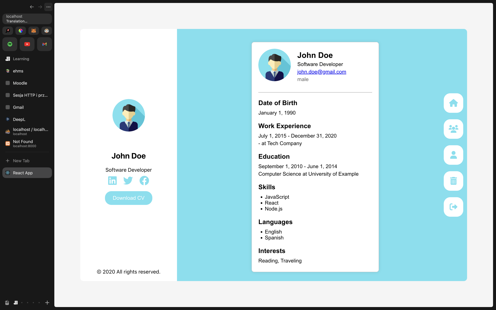

# Project: MERN Stack with Authentication Token

This project is divided into two main parts: `client` and `server`. Each folder contains its own `package.json` file, listing all the required modules that need to be installed before running the project.

## Table of Contents

- [Project Overview](#project-overview)
- [Prerequisites](#prerequisites)
- [Installation](#installation)
- [Running the Project](#running-the-project)
- [Technologies Used](#technologies-used)
- [Screenshots](#screenshots)
- [Contact](#contact)

## Project Overview

This project demonstrates a full-stack application built using the MERN stack (MongoDB, Express.js, React, Node.js). It includes authentication using tokens to secure routes and manage user sessions.

## Prerequisites

Before you begin, ensure you have the following installed:

- JavaScript
- React
- Node.js (v14 or later)
- npm (v6 or later) or Yarn (v1.22 or later)
- MongoDB Atlas (Cloud MongoDB)

## Installation

To set up the project, follow these steps:

1. **Clone the repository:**
    ```bash
    git clone https://github.com/mikk1max/szpr_prpject.git
    cd szpr_prpject
    ```

2. **Install dependencies for the server:**
    ```bash
    cd server
    npm install
    # or
    yarn install
    ```

3. **Install dependencies for the client:**
    ```bash
    cd ../client
    npm install
    # or
    yarn install
    ```

## Running the Project

To run the project, you need to start both the client and server. Follow these instructions:

1. **Start the server:**
    ```bash
    cd server
    npm start
    # or
    yarn start
    ```

2. **Start the client:**
    ```bash
    cd ../client
    npm start
    # or
    yarn start
    ```

By default, the server will run on `http://localhost:8080` and the client on `http://localhost:3000`.

## Technologies Used

**Frontend:**
- React
- React Router
- Axios
- JWT (JSON Web Tokens) for authentication

**Backend:**
- Node.js
- Express.js
- MongoDB (Mongoose for object data modeling)
- JWT (JSON Web Tokens) for authentication

## Screenshots

|  |  |
|:---------------------------------------:|:----------------------------------------:|
| *Screenshot - 1 - Home Page*            | *Screenshot - 2 - Form Page*             |

|  |  |
|:----------------------------------------:|:-------------------------------------:|
| *Screenshot - 3 - Users Page*            | *Screenshot - 4 - CV Page*             |

|  |  |
|:----------------------------------------:|:-----------------------------------------:|
| *Screenshot - 5 - Login Page*            | *Screenshot - 6 - Sign Up Page*           |

## Contact

For any questions or issues, please contact [maksim.shepeta@gmail.com](mailto:maksim.shepeta@gmail.com).

<a href="https://www.buymeacoffee.com/mikkimax" target="_blank"></a>
